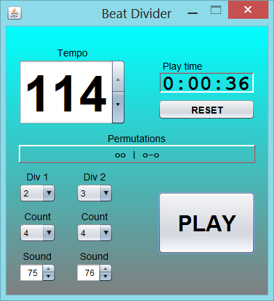
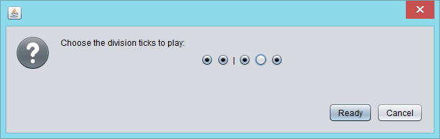

# BeatDivider

BeatDivider is a small rhythm machine application written in Java.
You can select the tempo, two divisions and counts for both divisions.
After pressing the PLAY button you can choose which ticks (permutations) are played.

BeatDivider plays the two divisions sequentially in a loop.
It uses your systems default MIDI synthesizer and sequencer.

## License

GNU GENERAL PUBLIC LICENSE Version 3

## Building

The main method is located in BeatDivider.java

## Download binary

NA (for now)
